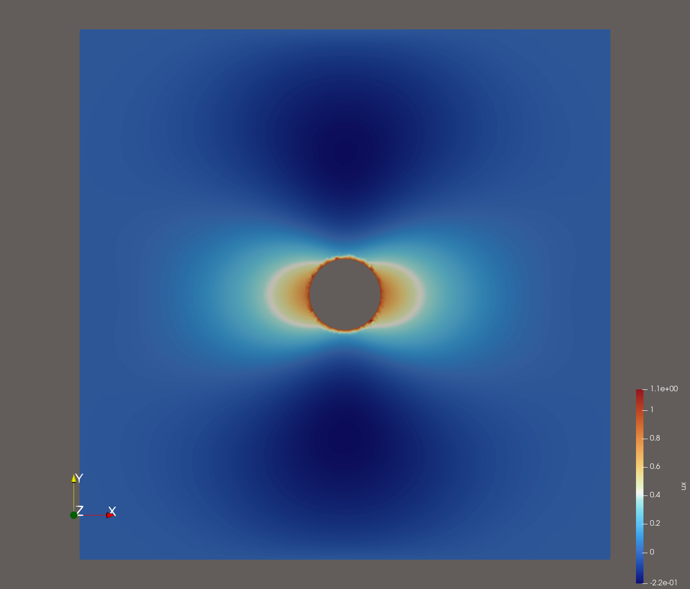

# Augmented Lagrangian finite element solver for yield-stress flow

This repository provides a Python implementation of an augmented Lagrangian finite element method for viscoplastic yield-stress flow. The finite element method is implemented using [FEniCSx](https://fenicsproject.org/).

The problem is solved using Uzawa iterations where at each iteration:
1. A Stokes-type problem is solved for the flow velocity and pressure fields.
2. The stress tensor and strain rate (Lagrange multipliers) enforcing the yield condition are updated.
3. Convergence is checked based on residual norms of the augmented system.

***The project is WIP and needs verifation for correctness.***

---

## Bingham fluid flow
Currently, only Bingham flow is implemented. The governing equations for steady flow of an incompressible Bingham fluid are given by:

$0 = \frac{\partial \sigma_{ij}}{\partial x_j} + \rho f_j$, $\bar x \in \Omega$ (conservation of momentum)

$\frac{\partial u_i}{\partial x_i} = 0$ , $\bar x \in \Omega$ (incompressibility)

where $\bar u$ is the fluid velocity, and $\sigma_{ij}$ is the stress tensor given by $\sigma_{ij} = \tau_{ij} - p \delta_{ij}$, with $p$ fluid pressure.

Further, $\tau_{ij}$ is the deviatoric stress tensor, which depends on strain rate 

$\dot\gamma_{ij} = \frac{\partial u_i}{\partial x_j} + \frac{\partial u_j}{\partial x_i}$. 

For a Bingham fluid, we specifically have [3]

$\tau_{ij} = \left(\mu_p + \frac{\tau_Y}{\|\dot\gamma\|}\right)\dot\gamma_{ij}$ if $\|\tau\| \ge \tau_Y$

$\dot\gamma_{ij} = 0$ otherwise

where $\|T\|^2 = 0.5 T_{ij}^2$ for a second-order tensor $T$.

## Test cases
### `bingham_particle.py`:

Solver for particle sedimenting in an incompressible Bingham fluid (or equivalently Bingham flow about a cylinder). See Figure 1. and [2] for a similar problem setup.

<figure>
    
    <figcaption>Figure 1. Problem setup considered in `bingham_particle.py`.</figcaption>
</figure>

No-slip boundary conditions are set on $\Gamma_R$ while slip boundary conditions equal to $U$ are set on $\Gamma_C$.

Currently, a few different augmented Lagrangian variational formulations are implemented for this problem, which can be set through the variable `var_form_str`.
The options are:

- 'CT19-alg1': Algorithm 1. in [1]
- 'CT19-alg3': Algorithm 3. in [1], but with elastic effects omitted.
- 'RS03': The algorithm presented in [2].
- 'freeFEM': A variational form based on a reference FreeFEM implementation.

Currently, for the same problem setup 'RS03' results in almost the entire fluid yielding, while for 'CT19-alg3' and 'freeFEM' gives similar results, where the fluid only yields close to the particle. 'CT19-alg1' diverges. Results from 'RS03' are presented in Figure 2, where in the left figure $q$ is the relaxed strain rate, $\dot D$ is the deformation rate, i.e., $\dot D_{ij} = 0.5 \dot \gamma_{ij}$, and superscripts is the iteration index.

Run with `mpirun -np N python bingham_particle.py` where `N` is the number of MPI processes. Results are written in `BP4` format to `results/bingham_particle/<var_form_str>` and can be read with e.g., [ParaView](https://www.paraview.org/).

**TODO**:
- Fix/understand diverging results between different variational forms in the Bingham fluid solver. Verify correctness!
- Adaptive mesh refinement. See adaptive mesh refinement strategies in [1] and [2].


<figure float="left">
    
         
    <figcaption>Figure 2. (left) x-component of fluid velocity after 1845 Uzawa iteration, (right) iteration residuals.</figcaption>
</figure>


### `stokes_particle.py`:
Solves only the Stokes sub-problem on the particle domain using a manufactured solution. Intended for verification of the Stokes solver.

Run with `python stokes_particle.py mode` where `mode` is either `plot` (plotting solution and errros) or `conv` (performs a convergence study).

### Stokes sub-problem solver details
The Stokes-type subproblem is discretized using Taylor–Hood finite elements (P2–P1: quadratic velocity, linear pressure). This system is solved using the [PETSc](https://petsc.org/release/#) implementations of either
  - Iterative: MINRES with block AMG & Jacobi preconditioning
  - Direct: SuperLU.

## Dependencies
- [Python](https://www.python.org/) - tested on v3.13.5.
- [FEniCSx](https://fenicsproject.org/) - tested on v0.9.0
- MPI - tested on [mpich](https://www.mpich.org/) v4.3.1
- [pyvista](https://docs.pyvista.org/) tested on v0.46.1
- [gmsh](https://gmsh.info/) tested on v4.13.1
- [meshio](https://github.com/nschloe/meshio) tested on v5.3.5
- [SciPy](https://scipy.org/) - tested on v1.16.1 

To install with `conda`:
```bash
conda create -n ysf-alfem-env # Create new environment 
conda install -n ysf-alfem-env -c conda-forge cxx-compiler cmake fenics-dolfinx mpich pyvista python-gmsh meshio scipy
```
(Note: The cxx-compiler and cmake packages were required in order for the compiler linking to work properly on an Apple M3 chip.)

To install from source I recommend using [Spack](https://spack.io/). See [DOLFINx documentation](https://github.com/FEniCS/dolfinx#installation) for further details on installation.

---

## References
1. [E. Chaparian, O. Tammisola, An adaptive finite element method for elastoviscoplastic fluid flows, Journal of Non-Newtonian Fluid Mechanics, 2019](https://doi.org/10.1016/j.jnnfm.2019.104148)
2. [N. Roquet, P. Saramito, An adaptive finite element method for Bingham fluid flows around a cylinder, Computer Methods in Applied Mechanics and Engineering, 2003](https://doi.org/10.1016/S0045-7825(03)00262-7)
3. [N. J. Balmforth, I. A. Frigaard, G. Ovarlez, Yielding to Stress: Recent Developments in Viscoplastic Fluid Mechanics, Annual Review of Fluid Mechanics, 2014](https://doi.org/10.1146/annurev-fluid-010313-141424)
